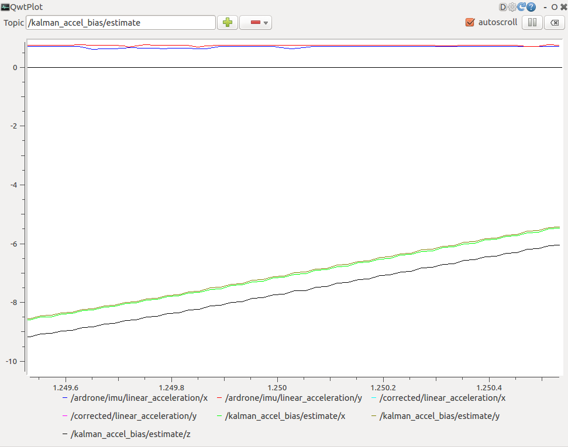

# drone_KF
ARドローンより得られるIMUデータを用いて、姿勢角をカルマンフィルタにより推定する。　　

**node_name**
* angle_estimator
* pose_estimator
* accel_bias_estimator


## 環境構築

ドローンのシミュレータ関係一式
```bash
git clone git@github.com:lancer-evolution/ardrone.git
```

## 実行

シミュレータとコントローラを起動する。
```bash
roslaunch cvg_sim_gazebo ardrone_testworld.launch
rosrun tum_ardrone drone_gui
```

##### 姿勢角の推定

※現在調整中
```bash
rosrun drone_kf angle_estimator
```

比較するためのグラフ
```bash
rqt_plot
```


**状態方程式**

```math
x_{k+1}=Ax_k+Bu_k
```

##### 位置の推定

※調整中

```bash
rosrun drone_kf pose_estimator
```

##### 加速度のバイアス誤差の推定

```bash
rosrun drone_kf accel_bias_estimator
```

参考：`bias:0.688904,0.742945,0.109892`





